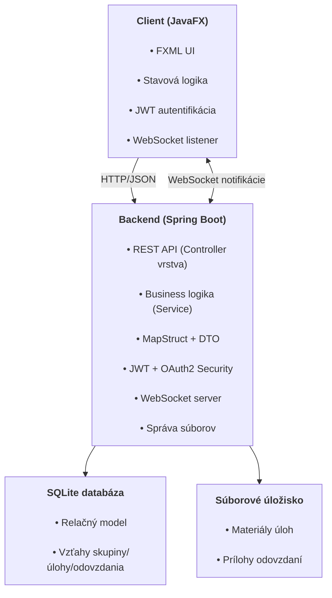
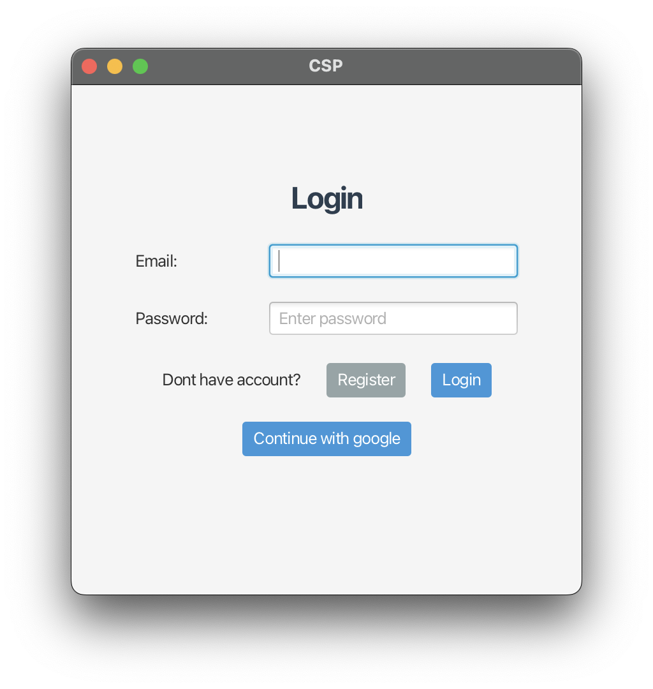
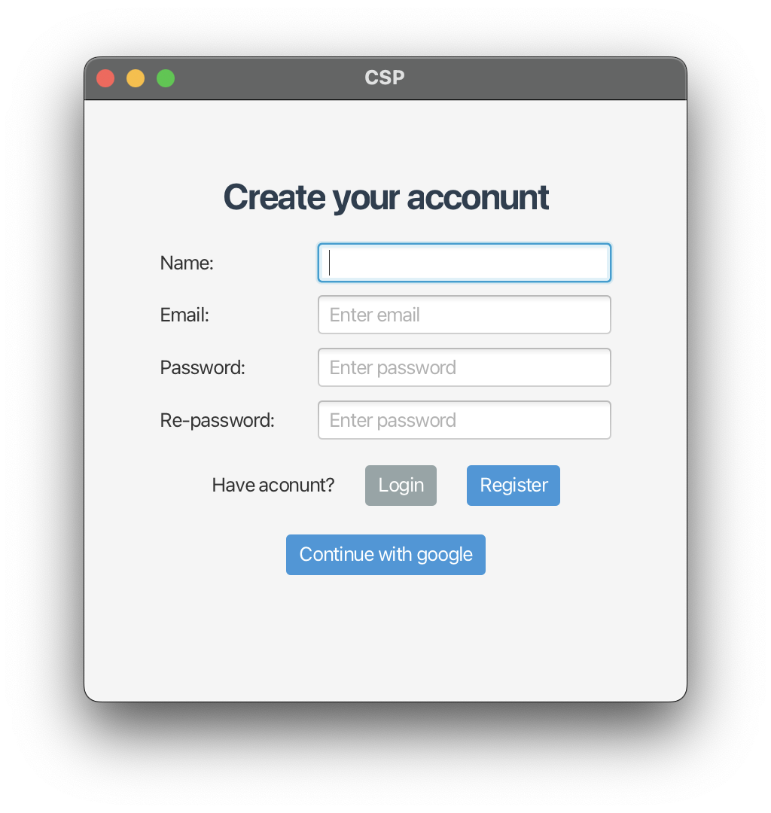
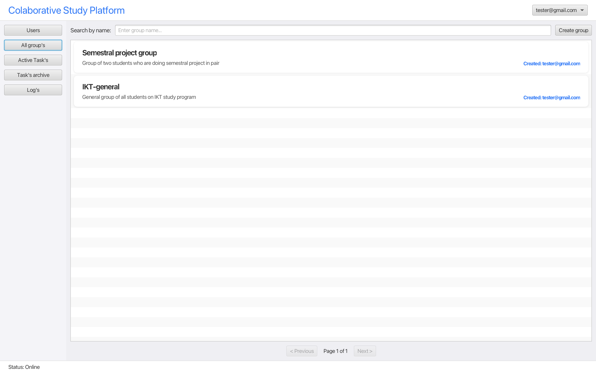
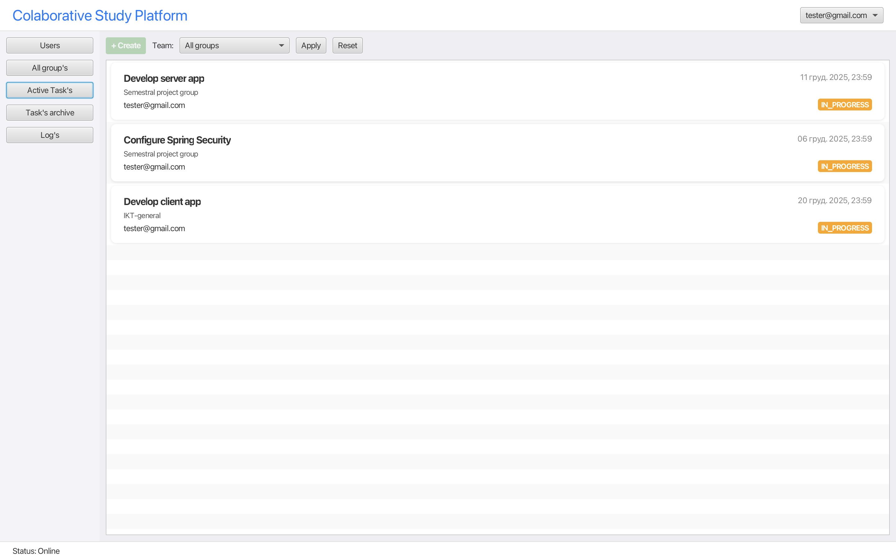
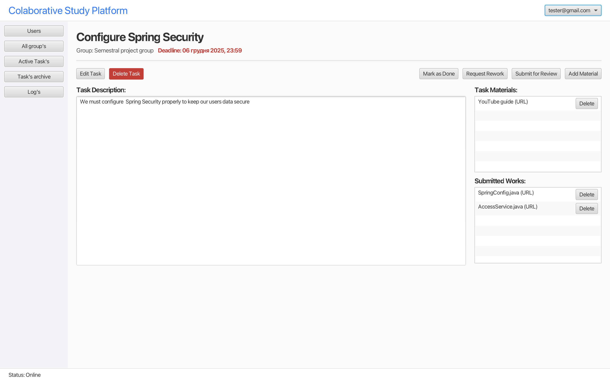

# Collaborative Study Platform

## 1. Stručný popis projektu a cieľov aplikácie

Aplikácia **Collaborative Study Platform** je desktopová študijná platforma určená pre vysokoškolských študentov, ktorí spolupracujú v tímoch na predmetových úlohách a projektoch.

Hlavné funkcie:

- tvorba študijných **skupín** (napr. podľa predmetu alebo projektu),
- správa **úloh** v rámci skupín (popis, stav, deadline),
- pridávanie **študijných materiálov** k úlohám (súbory, odkazy),
- **odovzdávanie riešení** úloh študentmi,
- sledovanie **deadline-ov** a plánovanie práce,
- **notifikácie** (napr. nová úloha, blížiaci sa deadline, nové riešenie),
- autentifikácia používateľov (klasický login + Google OAuth2),
- rôzne **rolové oprávnenia** (globálne roly používateľa + roly v skupinách).

Cieľom aplikácie je pomôcť študentom:

- mať všetky úlohy, materiály a odovzdané riešenia na jednom mieste,
- lepšie si rozplánovať prácu podľa deadline-ov,
- efektívne spolupracovať v rámci študijných skupín.

---

## 2. Architektúra systému

Aplikácia je rozdelená na tri hlavné časti:

- **Klient (frontend)** – desktopová aplikácia v JavaFX
- **Server (backend)** – Spring Boot aplikácia (REST API + WebSocket)
- **Databáza** – relačná databáza (SQLite)

### 2.1 Diagram architektúry



### 2.2 Vysvetlenie vrstiev

* **JavaFX klient**

  * zobrazuje GUI (FXML scény),
  * rieši prihlasovanie, zobrazenie skupín, úloh, materiálov, odovzdávok,
  * komunikuje so serverom cez REST API a WebSocket,
  * zohľadňuje roly používateľa a roly v skupine (čo môže vidieť/meniť).

* **Spring Boot backend**

  * implementuje obchodnú logiku,
  * poskytuje REST API pre klienta (CRUD operácie nad entitami),
  * zabezpečuje autentifikáciu a autorizáciu (JWT + Google OAuth2),
  * spracúva súbory (uloženie materiálov a odovzdaných riešení),
  * posiela notifikácie cez WebSocket (napr. nové úlohy, deadline).

* **Databáza**

  * ukladá dáta o používateľoch, skupinách, úlohách, materiáloch, odovzdaných riešeniach a notifikáciách,
  * zabezpečuje konzistenciu dát a väzby medzi entitami.


---

## 3. Databázový model (ER diagram)


Звісно!
Ось **повна словацька версія** твоєї стислої API-документації.

---

# 4. Dokumentácia REST API a WebSocket endpointov

Základná URL: **`http://localhost:8080`**

---

# Auth API

## **POST /api/auth/register**

Vytvorenie nového používateľa.
**Body:** `RegisterRequest`
**Response:** stav (200–201)

## **POST /api/auth/login**

Prihlásenie používateľa.
**Body:** `{ username, password }`
**Response:** JWT token / user objekt

## **POST /api/auth/logout**

Odhlásenie
**Response:** stav

## **GET /api/auth/me**

Získanie informácií o aktuálnom používateľovi
**Response:** `UserDetailedDTO`

---

# Users API

## **GET /api/user**

Zoznam používateľov
**Query params:** `page`, `size`, `search`
**Response:** `PageUserPartialDTO`

## **POST /api/user**

Vytvoriť používateľa
**Body:** `UserCreateDTO`
**Response:** stav

## **GET /api/user/{id}**

Získať jedného používateľa
**Response:** `UserDetailedDTO`

## **PATCH /api/user/{id}**

Aktualizovať používateľa
**Body:** `UserUpdateDTO`
**Response:** stav

## **DELETE /api/user/{id}**

Odstrániť používateľa
**Response:** stav

## **GET /api/user/{id}/stats**

Štatistiky používateľa (počet úloh v jednotlivých stavoch)
**Response:** `UserStats`

---

# Groups API

## **GET /api/group**

Zoznam skupín
**Query params:** `search`, `userId`, `page`, `size`
**Response:** `PageGroupPartialDTO`

## **POST /api/group**

Vytvoriť skupinu
**Body:** `GroupCreateDTO`
**Response:** stav

## **GET /api/group/{id}**

Detail skupiny
**Response:** `GroupDetailedDTO`

## **PATCH /api/group/{id}**

Aktualizovať skupinu
**Body:** `GroupUpdateDTO`
**Response:** stav

## **DELETE /api/group/{id}**

Odstrániť skupinu
**Response:** stav

---

# Memberships API

## **POST /api/membership**

Pridať používateľa do skupiny
**Body:** `MembershipCreateDTO`
**Response:** stav

## **PATCH /api/membership/{id}**

Aktualizovať rolu v skupine
**Body:** `MembershipUpdateDTO`
**Response:** stav

## **DELETE /api/membership/{id}**

Odstrániť člena skupiny
**Response:** stav

---

# Tasks API

## **GET /api/task**

Zoznam úloh
**Query params:**

* `groupId`, `userId`, `status`
* stránkovanie: `page`, `size`
  **Response:** `PageTaskPartialDTO`

## **POST /api/task**

Vytvoriť úlohu
**Body:** `TaskCreateDTO`
**Response:** stav

## **GET /api/task/{id}**

Získať detail úlohy
**Response:** `TaskDetailedDTO`

## **PATCH /api/task/{id}**

Aktualizovať úlohu
**Body:** `TaskUpdateDTO`
**Response:** stav

## **DELETE /api/task/{id}**

Odstrániť úlohu
**Response:** stav

## **GET /api/task/active**

Aktívne úlohy (IN_PROGRESS + IN_REVIEW)
**Query params:** `groupId`, `userId`, `page`, `size`
**Response:** `PageTaskPartialDTO`

---

# Resources API

## **GET /api/resource**

Zoznam zdrojov
**Query params:** `taskId`, `page`, `size`
**Response:** `PageResourceDetailedDTO`

## **POST /api/resource**

Vytvoriť zdroj
**Body:** `ResourceCreateDTO`
**Response:** `ResourceShortDTO`

## **GET /api/resource/{id}**

Získať zdroj
**Response:** `ResourceDetailedDTO`

## **PATCH /api/resource/{id}**

Aktualizovať zdroj
**Body:** `ResourceUpdateDTO`
**Response:** stav

## **DELETE /api/resource/{id}**

Odstrániť zdroj
**Response:** stav

---

# Files for Resources (Súbory)

## **POST /api/resource/{id}/file**

Nahrať súbor
**Body:** multipart/form-data (file)

## **GET /api/resource/{id}/file**

Stiahnuť alebo získať súbor

## **DELETE /api/resource/{id}/file**

Odstrániť súbor

---

# Logs API

## **GET /api/log**

Zoznam aktivít
**Query params:** `page`, `size`
**Response:** `PageActivityLogDetailedDTO`

## **GET /api/log/{id}**

Detail aktivity
**Response:** `ActivityLogDetailedDTO`

## **GET /api/log/user/{id}**

Aktivity podľa používateľa
**Query params:** `page`, `size`
**Response:** `PageActivityLogDetailedDTO`

---

# WebSocket Notifikácie

Backend používa WebSocket kanál na odosielanie real-time notifikácií používateľom.
Odosielanie správ zabezpečuje služba **`NotificationService`**, ktorá posiela správy pomocou:

* `messageHandler.sendToUser(userId, message)`
* používateľ je identifikovaný cez svoj *userId*
* správy majú formát `NotificationMessage`

---

# Formát notifikácie

Každá notifikácia sa odosiela ako objekt:

```json
{
  "type": "TASK_CREATED | DEADLINE_SOON | TASK_UPDATED | TASK_COMPLETED | GROUP_INVITATION",
  "title": "string",
  "message": "string",
  "taskId": 123,    
  "groupId": 456
}
```

### Popis polí

| Pole        | Typ       | Popis                      |
| ----------- | --------- | -------------------------- |
| **type**    | enum      | Typ notifikácie            |
| **title**   | string    | Krátky nadpis notifikácie  |
| **message** | string    | Detailný text              |
| **taskId**  | long/null | ID úlohy, ak sa týka úlohy |
| **groupId** | long      | ID skupiny                 |

---

# Typy notifikácií (NotificationType)

| Typ                | Kedy sa používa                   |
| ------------------ | --------------------------------- |
| `TASK_CREATED`     | Nová úloha bola vytvorená         |
| `DEADLINE_SOON`    | Blíži sa deadline úlohy           |
| `TASK_UPDATED`     | Úloha bola upravená               |
| `TASK_COMPLETED`   | Úloha bola dokončená              |
| `GROUP_INVITATION` | Používateľ bol pozvaný do skupiny |

---

# WebSocket endpoint

Frontend sa pripája na WebSocket cez:

```
ws://localhost:8080/ws
```

Každý používateľ má súkromný kanál, na ktorý server posiela správy:

```
/user/{userId}/queue/notifications
```

---

# Činnosť NotificationService

Služba automaticky vyhľadá všetkých používateľov v skupine a odošle im notifikáciu.

## **1. notifyTaskCreated(Task task)**

Odosiela notifikáciu všetkým členom skupiny, ak bola vytvorená nová úloha.

**Typ:** `TASK_CREATED`
**Message:** „New task '<title>' in group <groupName>“

---

## **2. notifyDeadlineSoon(Task task)**

Odosiela upozornenie, že sa blíži deadline úlohy.

**Typ:** `DEADLINE_SOON`
**Message:** „Task '<title>' deadline is near“

---

## **3. notifyTaskUpdated(Task task)**

Odosiela informáciu, že úloha bola aktualizovaná.

**Typ:** `TASK_UPDATED`
**Message:** „Task '<title>' was updated“

---

## **4. notifyTaskCompleted(Task task)**

Odosiela správu, že úloha bola dokončená.

**Typ:** `TASK_COMPLETED`
**Message:** „Task '<title>' was marked as completed“

---

## **5. notifyGroupInvitation(Group group, int invitedUserId)**

Odosiela pozvánku do skupiny jednému používateľovi.

**Typ:** `GROUP_INVITATION`
**Message:** „You were invited to group '<groupName>'“

---

# Príklad správy, ktorú frontend dostane

```json
{
  "type": "TASK_UPDATED",
  "title": "Task updated",
  "message": "Task 'Prepare slides' was updated",
  "taskId": 12,
  "groupId": 4
}
```

# Ukážky používateľského Rozhrania


*Prihlasovacie okno – používateľ sa môže prihlásiť cez email/heslo alebo Google OAuth2.*


*Registračne okno – používateľ sa môže registrovať cez email/heslo alebo Google OAuth2.*


*Prehľad skupín, do ktorých používateľ patrí. Možnosť vytvoriť novú skupinu.*


*Detail vybranej skupiny s prehľadom úloh, členov a základnými štatistikami.*


*Detail úlohy, zoznam materiálov a formulár na odovzdanie riešenia.*

**Základný tok práce s aplikáciou:**

1. Používateľ sa prihlási (alebo zaregistruje, prípadne použije Google login).
2. Zobrazí sa mu zoznam skupín, do ktorých patrí.
3. V rámci skupiny vidí úlohy, materiály a členov.
4. Študent si otvorí konkrétnu úlohu, stiahne materiály a odovzdá riešenie.
5. Vlastník/tútor skupiny môže pridávať úlohy, meniť ich stav a kontrolovať odovzdané riešenia.
6. Notifikácie informujú používateľa o nových úlohách a blížiacich sa deadline-och.

---

## 6. Popis výziev a riešení

Počas vývoja som narazil na viaceré technické výzvy:

* **Univerzálnosť klienta a roly**

  * Bolo náročné navrhnúť JavaFX obrazovky tak, aby fungovali pre rôzne roly používateľa (globálna rola) aj rôzne roly v skupinách.
  * Riešenie: oddelenie logiky právomocí od UI, použitie viacerých DTO (short/partial/detailed) podľa potreby obrazovky.

* **Prechod z cookies-session na JWT**

  * Pôvodne bol backend postavený na session s cookies.
  * Pre integráciu **Google OAuth2** a jednoduchšiu desktopovú komunikáciu som prešiel na **JWT**.
  * Bolo potrebné upraviť bezpečnostnú konfiguráciu, filter, aj klienta (posielanie tokenu v hlavičkách).

* **Veľa typov DTO**

  * V priebehu vývoja sa ukázalo, že jeden DTO pre entitu nestačí (napr. skupina v zozname vs. detail skupiny).
  * Riešenie: zaviedol som **short / partial / detailed DTO**, aby klient vždy dostal len potrebné dáta.

* **Problémy s modulárnym systémom v klientovi**

  * Java modulárny systém (module-info) komplikoval importy a používanie knižníc v JavaFX kliente.
  * Riešenie: úprava module-info, jasnejšie rozdelenie modulov a závislostí.

* **MapStruct**

  * MapStruct sa občas "záhadne" prestal kompilovať (chýbajúce generované triedy a pod.).
  * Riešenie: čistenie build-u, kontrola anotácií, správne balíčkovanie a postupné jednoduché mapovania.

---

## 7. Zhodnotenie práce s AI

Pri vývoji som využíval AI nástroje (napr. ChatGPT) najmä nasledovne:

* **Backend (server)**

  * Kód servera je takmer celý napísaný manuálne.
  * AI som používal hlavne pri riešení nezrozumiteľných **exception-ov**, pri vysvetlení správania Springu a pri konzultácii návrhu (napr. bezpečnosť, správa tokenov).
  * Naučil som sa lepšie čítať stack trace a cielene hľadať príčinu problému.

* **Frontend (JavaFX klient)**

  * Na začiatku som AI používal intenzívnejšie – potreboval som pochopiť:

    * ako funguje **FXML**, controllery a event callbacky,
    * ako sa správne **prepínajú scény**,
    * ako organizovať kód pre znovupoužiteľné obrazovky.
  * Postupne, ako som sa v JavaFX zorientoval, som AI používal skôr ako konzultanta a nie generátor hotového kódu.

* **Čo bolo potrebné manuálne doladiť**

  * Generovaný alebo navrhnutý kód od AI bolo väčšinou potrebné prispôsobiť aktuálnej štruktúre projektu (balíčky, názvy entít, DTO).
  * UI logiku (konkrétne obrazovky, rozloženie a práva používateľa) bolo nutné navrhnúť manuálne, pretože závisí od konkrétneho modelu roly v aplikácii.

* **Čo som sa naučil**

  * efektívnejšie pracovať so Spring Boot (bezpečnosť, JWT, integrácia OAuth2),
  * základy návrhu desktopového GUI v JavaFX,
  * ako si navrhnúť vlastný ER model a premietnuť ho do JPA entít.
